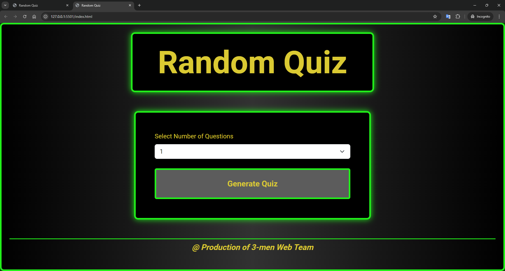
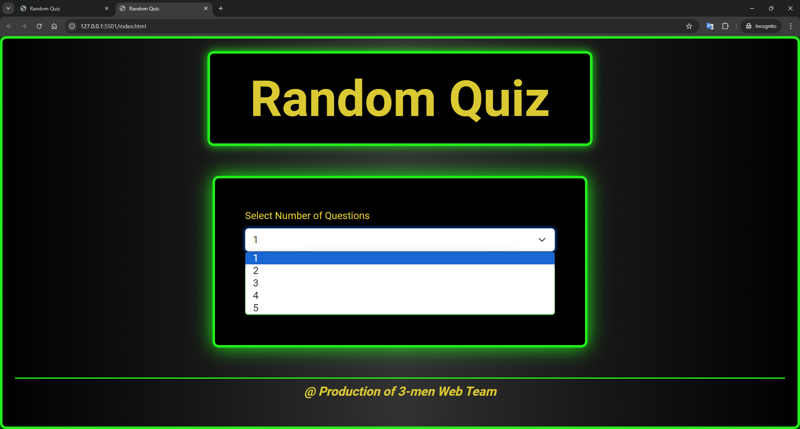
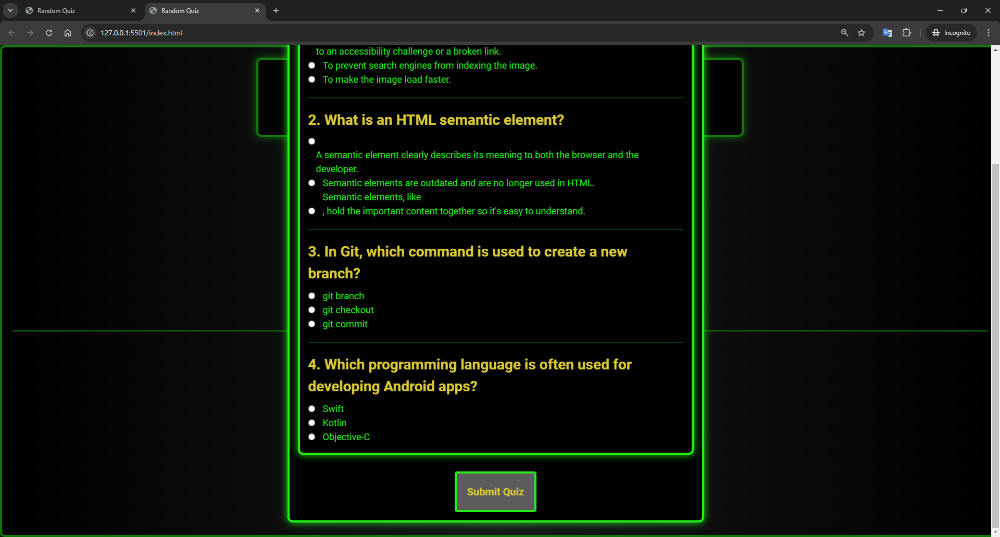
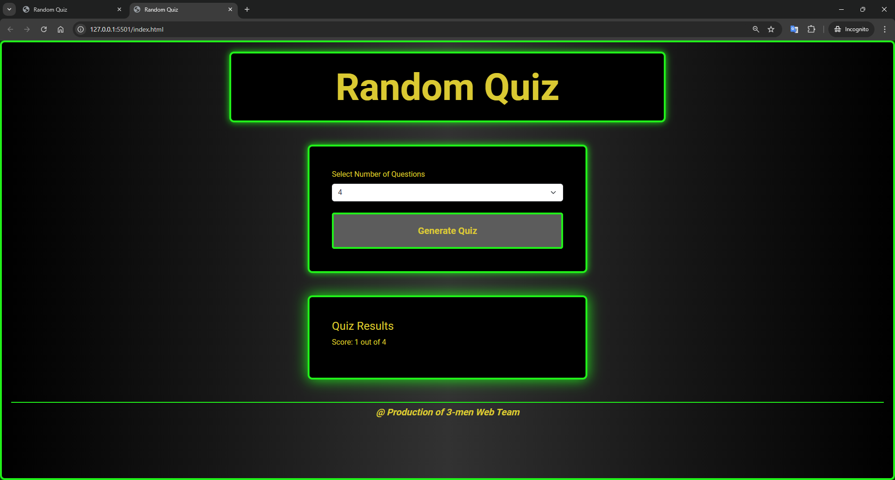

# randomQuiz
## Web Address
https://attackonbaron-bc.github.io/randomQuiz/

## Description

### User Story
- **As a student**, I want to open this web page and it will generate random questions for me to answer.
- **After I** clicked the submit button, there will be a pop up to tell me how many scores I have got.

### Acceptance Criteria
-   A student is able to visit the web page, and select to generate 1 to 5 random question(s).
-   It will pop up the modal with the questions, after clicking the submit button, the modal will disappear and the page will show the score and time used.

## Deployment
No need to deploy, please directly visit our website!

## Screenshots

## Features
- The random quiz can randomly generate 5 different questions,
- It will show the scores after clicking the submit button.

## Authors
- J He - https://github.com/AttackOnBaron-BC
- Brad Smith - https://github.com/Brad-Smith-90
- Evan Gehr - https://github.com/EvanGehr

## License
This project is licensed under the MIT License. For more details, see the [LICENSE](LICENSE) file.